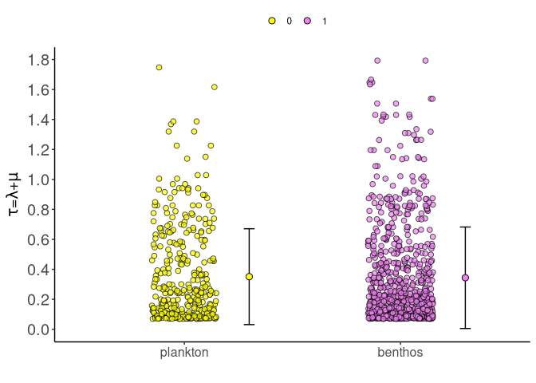

<!-- README.md is generated from README.Rmd. Please edit that file -->

# gghisse

<!-- badges: start -->

<!-- badges: end -->

The goal of `gghisse` is to provide additional ways to visualize results
from `hisse` family models
([HiSSE](https://cran.r-project.org/web/packages/hisse/index.html)
objects)

## Installation

<!-- You can install the released version of `gghisse` from [CRAN](https://CRAN.R-project.org) with: -->

<!-- ``` r -->

<!-- install.packages("gghisse") -->

<!-- ``` -->

The development version can be installed from from
[GitHub](https://github.com/) with:

``` r
# install.packages("devtools")
devtools::install_github("discindo/gghisse")
```

A CRAN submission is forthcoming.

## Web application

To see the main functionality and example code, visit the Shiny web
application: <https://diatom.shinyapps.io/hisse-web/>

## Example usage

``` r
library("gghisse")
#> Loading required package: hisse
#> Loading required package: ape
#> Loading required package: deSolve
#> Loading required package: GenSA
#> Loading required package: subplex
#> Loading required package: nloptr
#> Loading required package: dplyr
#> 
#> Attaching package: 'dplyr'
#> The following objects are masked from 'package:stats':
#> 
#>     filter, lag
#> The following objects are masked from 'package:base':
#> 
#>     intersect, setdiff, setequal, union
#> Loading required package: ggplot2
#> Registered S3 method overwritten by 'treeio':
#>   method     from
#>   root.phylo ape
data("diatoms")
processed_hisse <- gghisse::h_process_recon(hisse_recon=diatoms$cid4_recon)
hisse_rates_plot <- gghisse::h_scatterplot(
  processed_recon=processed_hisse,
  parameter="turnover")
```

As `gghisse` is built on top of `ggplot2`, modifications to `gghisse`
plots are easy with the familiar `ggplot` functions. For example,
changing X axis tick labels:

``` r
hisse_rates_plot +
  scale_x_discrete(breaks=c(0,1), labels=c("plankton", "benthos"))
```


Or changing the position of the legend

``` r
hisse_rates_plot +
  scale_x_discrete(breaks=c(0,1), labels=c("plankton", "benthos")) +
  theme(legend.position="top")
```


Or using expressions (for Greek letters) in the axis labels

``` r
hisse_rates_plot +
  scale_x_discrete(breaks=c(0,1), labels=c("plankton", "benthos")) +
  theme(legend.position="top") +
  labs(y=expression(paste(tau, "=", lambda, "+", mu))) +
  theme(axis.text.y=element_text(size=15))
```


